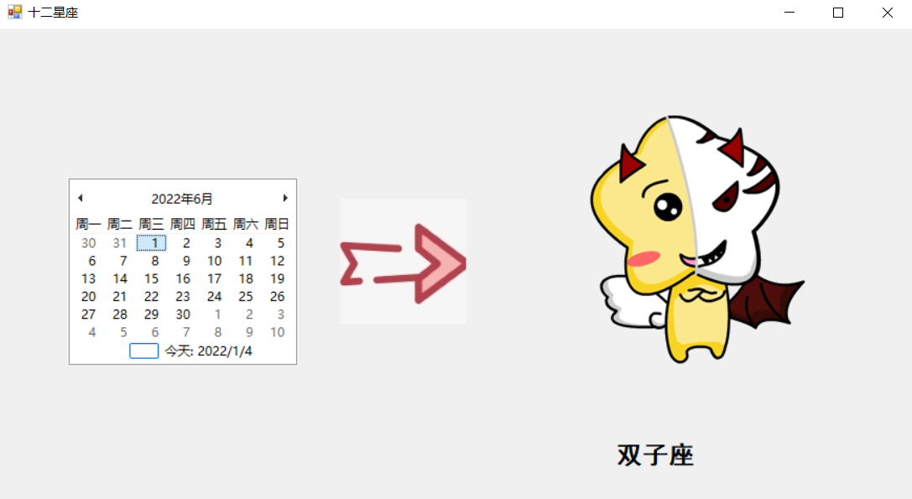

# C\#十二星座判别应用程序

这是继学习Java和VB.NET后，对C#的一次突击学习，以十二星座为项目案例进行训练。



参考资料：
- [VisualStudio2019连接Github](https://www.jianshu.com/p/5cf4e8da1a81)
- [VisualStudio连接Github](https://blog.csdn.net/qq_36330228/article/details/85079465)
- [C#相对路径](https://www.cnblogs.com/Holmes-Jin/archive/2012/03/15/2398081.html)

图片位置：<code>D:\VisualBasic\CSharpFrameworkTest\CSharpFrameworkTest\images</code><br/>
因为不太会用C#相对路径，所以比较粗暴的选了直接路径

核心代码：
```csharp
private void monthCalendar1_DateChanged(object sender, DateRangeEventArgs e)
{
    int month = monthCalendar1.SelectionStart.Month;
    int day = monthCalendar1.SelectionStart.Day;
    judgeConstellation(month, day);
}

private void judgeConstellation(int month, int day)
{
    String[] starArr = {"魔羯座","水瓶座", "双鱼座", "白羊座", "金牛座", "双子座", "巨蟹座", "狮子座", "处女座", "天秤座", "天蝎座", "射手座" };
    int[] dayArr = { 22, 20, 19, 21, 21, 21, 22, 23, 23, 23, 23, 22 };
    int number = (month + 10) % 12;
    int index = month;
    if (day < dayArr[index-1])
    {
        number = (number + 11) % 12;
        index = index - 1;
    }
    if (number == 0)
    {
        number = 12;
    }
    label1.Text = starArr[index];
    pictureBox2.ImageLocation = "D:\\VisualBasic\\CSharpFrameworkTest\\CSharpFrameworkTest\\images\\" + number + ".png";
}
```

完事儿！奈斯奈斯！
